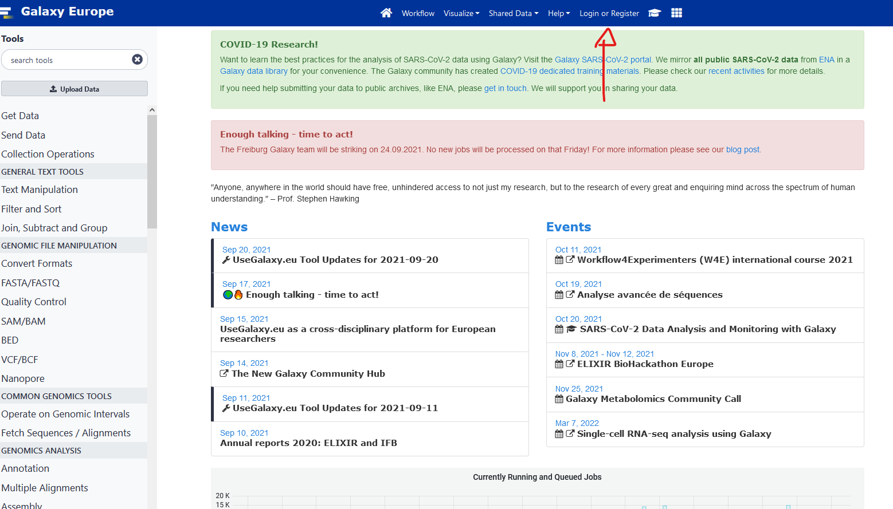
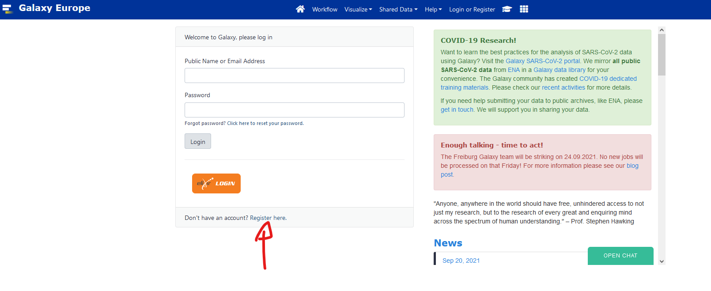

# Metagenomics

## Introduction

[https://usegalaxy.eu/join-training/heh-mag2025](https://usegalaxy.eu/join-training/heh-mag2025/)

1. Introduction to Galaxy [here](https://training.galaxyproject.org/training-material/topics/introduction/tutorials/galaxy-intro-short/tutorial.html) 
2. Introduction to Metagenomics and environmental studies [Slides 1](Presentation/intro_to_metagenomics.pdf) [Slides 2](https://training.galaxyproject.org/training-material/topics/metagenomics/slides/introduction.html#1)
3. [The global presentation](Presentation/Metagenomics_global_RVanDamme.pdf)
4. Muffin A nextflow Genomic Workflow [Slides](Presentation/MUFFIN_genomic_workflow.pdf)

### Additional Introductions:

* Link to all [Galaxy Metagenomics courses](https://training.galaxyproject.org/training-material/topics/metagenomics/)
* [Analyses of metagenomics data - The global picture 2,5-3h by Galaxy](https://training.galaxyproject.org/training-material/topics/metagenomics/tutorials/general-tutorial/tutorial.html#shotgun-metagenomics-data)
* Ancient DNA and metagenomics [Slides](Presentation/Ancient_metagenomics.pdf)

## Shotgun metagenomics (assembly free)

[Slides](Presentation/shotgun_metagenomics.pdf)

Assembly-free method, [Practical 4h](usage/assembly_free.md)

### Galaxy alternative
[Identification of the micro-organisms in a beer using Nanopore sequencing 1-1,5h](https://training.galaxyproject.org/training-material/topics/metagenomics/tutorials/beer-data-analysis/tutorial.html#assign-taxonomic-classification)

## Shotgun metagenomics (with assembly)

Assembly and binning method, [Practical 4h](usage/assembly_binning_based.md)

### Galaxy alternative
[Assembly of metagenomic sequencing data 2-3h](https://training.galaxyproject.org/training-material/topics/metagenomics/tutorials/metagenomics-assembly/tutorial.html#visualization-of-the-de-novo-assembly-graph)

## Amplicon sequencing 

[Slides](Presentation/Metabarcoding.pdf)

[16S Microbial Analysis with mothur (short) 2-3h](https://training.galaxyproject.org/training-material/topics/metagenomics/tutorials/mothur-miseq-sop-short/tutorial.html#optional-calculate-error-rates-based-on-our-mock-community)

### alternatives
Galaxy:
[16S Microbial analysis with Nanopore data 2-3h](https://training.galaxyproject.org/training-material/topics/metagenomics/tutorials/nanopore-16S-metagenomics/tutorial.html)

Local:
[DADA2](usage/metabarcoding.md)

## Metatranscriptomics

[Metatranscriptomics analysis using microbiome RNA-seq data (short) 3-4h](https://training.galaxyproject.org/training-material/topics/metagenomics/tutorials/metatranscriptomics-short/tutorial.html)

# Grade breakdown

* 40% Active participation
* 20% Project report
* 40% Pre-Project presentation and discussion

# Project 

## instructions:

Find a tool, pipeline, or analysis method of metagenomics that has not been seen during the course and test and evaluate it.
You must explain how it works, how you found it, and its use in metagenomics studies.
You can compare it to a similar tool/method seen during the course.

You are tasked to have a report of at least two pages (not counting graphics, pictures, and tables).
Additional points will be provided if your work is easily reproducible (scripts, command list, and workflows provided in addition to the report).

## Project Grade breakdown

* 10% originality
* 20% Reasoning and Explanation of what it should do
* 30% execution and testing
* 20% analysis of the results
* 20% comparison to existing methods

## Presentation Plan 
You will present your individual project and a summary of the course.

**15 minutes** of group presentation where you summarise the principles and methods of metagenomics.

**15 minutes** of individual presentation where you expose your work:

* Methods selected and Why
  
* Results
  
* Discussion (comparison with a method seen during the course)


# Bibliography and ressources

Core Papers: 

* https://www.microbiologyresearch.org/content/journal/mgen/10.1099/mgen.0.000409

* https://www.nature.com/articles/nbt.3935/figures/1

* https://www.sciencedirect.com/topics/biochemistry-genetics-and-molecular-biology/metagenomics

Additional read: 

* https://www.nature.com/articles/nbt.3935

* https://www.nature.com/articles/srep01968

* https://www.frontiersin.org/articles/10.3389/fmicb.2021.613791/full

* https://academic.oup.com/bib/article/22/6/bbab330/6358409

* https://academic.oup.com/bib/article/21/2/584/5363831

* https://www.nature.com/articles/s42003-021-02510-6

* https://bmcbioinformatics.biomedcentral.com/articles/10.1186/s12859-020-03667-3

Tools:

* MUFFIN: https://github.com/RVanDamme/MUFFIN & https://journals.plos.org/ploscompbiol/article?id=10.1371/journal.pcbi.1008716

* metaWRAP: https://github.com/bxlab/metaWRAP & https://microbiomejournal.biomedcentral.com/articles/10.1186/s40168-018-0541-1

* Flye: https://github.com/fenderglass/Flye & https://www.nature.com/articles/s41592-020-00971-x

* Kraken2: https://github.com/DerrickWood/kraken2 & https://genomebiology.biomedcentral.com/articles/10.1186/s13059-019-1891-0

# Galaxy

## Galaxy set up

1. Register to [usegalaxy.eu](http://usegalaxy.eu/).






2. Click the verification link you will receive by email.

3. Go to this [https://usegalaxy.eu/join-training/heh-mag2025/](https://usegalaxy.eu/join-training/heh-mag2025/) to join our training session. 
It should say you successfully registered in heh-mag2025


## Galaxy introduction

Slides [here](https://training.galaxyproject.org/training-material/topics/introduction/tutorials/galaxy-intro-short/slides.html#1)

We will follow this [tutorial](https://training.galaxyproject.org/training-material/topics/introduction/tutorials/galaxy-intro-short/tutorial.html)

# Bioconda and Conda installation

We will follow the installation recommended by bioconda [directly](https://bioconda.github.io/user/install.html)

## Installation of bioconda

1. Install conda

Bioconda requires the conda package manager to be installed. If you have an Anaconda Python installation, you already have it. Otherwise, the best way to install it is with the Miniconda package. The Python 3 version is recommended.

On MacOS, run:

```bash
curl -O https://repo.anaconda.com/miniconda/Miniconda3-latest-MacOSX-x86_64.sh
sh Miniconda3-latest-MacOSX-x86_64.sh
```

On Linux, run:

```bash
curl -O https://repo.anaconda.com/miniconda/Miniconda3-latest-Linux-x86_64.sh
sh Miniconda3-latest-Linux-x86_64.sh
```

Follow the instructions in the installer. If you encounter problems, refer to the Miniconda [documentation](https://conda.io/en/latest/miniconda.html).


2. Set up channels

After installing conda, you will need to add the bioconda channel as well as the other channels bioconda depends on. It is important to add them in this order to set the priority correctly (that is, conda-forge is the highest priority).

The conda-forge channel contains many general-purpose packages not already found in the default channel.

```bash
conda config --add channels defaults
conda config --add channels bioconda
conda config --add channels conda-forge
```

3. Install packages

Browse the packages to see what’s available.

Bioconda is now enabled, so any packages on the bioconda channel can be installed into the current conda environment:

```bash
conda install bwa
```

Or a new environment can be created:

```bash
conda create -n aligners bwa bowtie hisat star
```

!!!! if you are on Ubuntu in WSL, you might get an HTTP error. To solve it, a simple reboot of your computer is enough.!!!!


## **Conda** Tutorial, guides, and CheatSheet

Here is a collection of materials to train and improve your conda use. All have their strength and weaknesses, the cheatsheet is your best friend when working.

* [NBIS tutorial](https://nbis-reproducible-research.readthedocs.io/en/course_2104/conda/)
* [Guide by Matthew Sarmiento](https://towardsdatascience.com/a-guide-to-conda-environments-bc6180fc533)
* [Guide by Whitebox](https://whiteboxml.com/blog/the-definitive-guide-to-python-virtual-environments-with-conda)
* [CheatSheet](https://docs.conda.io/projects/conda/en/4.6.0/_downloads/52a95608c49671267e40c689e0bc00ca/conda-cheatsheet.pdf)

